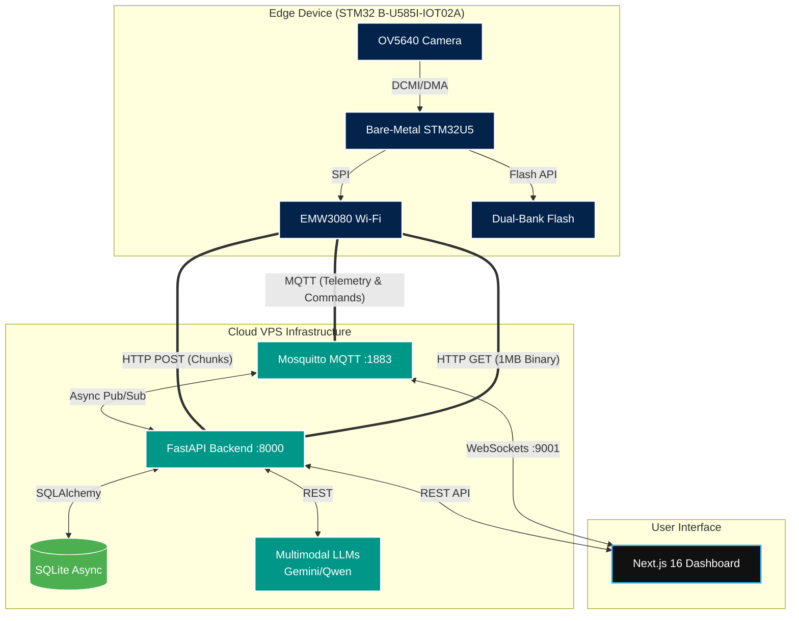
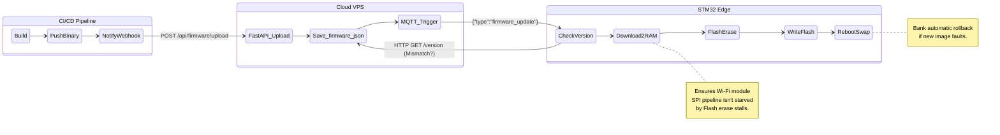

<p align="center">
  <h1 align="center">🔬 Autonomous IoT Visual Monitoring System</h1>
  <p align="center">
    <strong>STM32 Edge Camera with Multimodal LLM Intelligence</strong>
  </p>
  <p align="center">
    <em>Bachelor Thesis — Computer Science & Engineering</em>
    <br/>
    <sub>by <strong>Alexandru Cioc (WhitehatD)</strong></sub>
  </p>
</p>

<p align="center">
  
  
  
  
  
  
  
</p>

---

## 🚀 The Vision: Beyond Simple Sensors

Legacy industrial monitoring relies on dumb network cameras streaming petabytes of useless, empty footage to the cloud. This project introduces a fundamentally different paradigm: **Autonomous Visual Intelligence at the Edge**.

By combining a heavily optimized bare-metal STM32 microcontroller with state-of-the-art Multimodal Large Language Models (Gemini 3 Flash, Qwen3-VL), we deploy a zero-maintenance "eye" that actively understands its environment. It processes natural language prompts, creates its own execution schedules, captures high-fidelity RGB565 frames, and interprets the scene—all autonomously.

Built for reliability, the system features a complete CI/CD-driven Over-The-Air (OTA) update pipeline, ensuring the edge devices continuously evolve without ever being physically touched.

---

## ✨ Core Features

* 🧠 **LLM-Driven Scheduling**: NLP planning engine translates human instructions ("Check if the delivery bay is clear every morning at 9 AM") into machine-executable RTC alarm sequences over MQTT.
* ⚡ **Bare-Metal Performance**: Stripped-down, zero-RTOS C firmware maximizing the Cortex-M33's 160MHz capabilities. Complete memory control via stack watermark auditing.
* 📸 **Capture Optimization**: Sub-second image acquisition. OV5640 PCLK boosted with an 800-line VTS (~30fps) and 20ms AEC hardware polling. DCMI DMA leverages perfect End-of-Frame hardware suspension (`HAL_DCMI_Suspend`) to eliminate tearing and top-line artifacts.
* 🔄 **Zero-Downtime OTA Updates**: Dual-bank flash architecture. New firmware streams via chunked HTTP, verifies via CRC32, and executes an atomic memory bank swap. Built-in automatic rollback upon boot failure ensures devices can't be bricked remotely.
* 🚦 **Mutually Exclusive Observability**: A strictly defined visual state machine through onboard LEDs guarantees zero ambiguity during diagnostics (Green heartbeat for Idle, Solid Red for Capture & Upload, Red/Green Strobe for OTA Updates).
* 🌐 **Monitoring Dashboard**: A Next.js 16 control center featuring low-latency tactile feedback, real-time MQTT WebSocket pipelines, and live visual feeds.
* 🛡️ **Resilient CI/CD Deployment**: End-to-end GitHub Actions pipeline. A single `git push` runs tests, compiles the ARM GCC payload, builds Docker containers, synchronizes the cloud VPS, and pushes the binary update directly to the edge hardware over-the-air.

---

## 🏗️ Architecture Blueprint

The system spans from raw C hardware drivers to cloud-native Python services. The architecture is explicitly designed for **high observability** and **resilient edge-to-cloud communication**.

### 1. The Global Network Topology



### 2. High-Fidelity Capture Lifecycle

The image capture process is tracked with microsecond precision. The dashboards acts as a true digital twin, reflecting state changes instantly.

```mermaid
sequenceDiagram
    participant Dash as Dashboard
    participant MQTT as Mosquitto
    participant Server as FastAPI
    participant Board as STM32 Edge
    
    Dash->>MQTT: Publish {"type":"capture_now"}
    MQTT->>Board: Route to device/stm32/commands
    
    rect rgb(20, 40, 60)
        Note over Board,Dash: Capture Phase
        Board->>MQTT: status: {"status":"job_received"}
        Board->>MQTT: status: {"status":"camera_init"}
        Board->>MQTT: status: {"status":"capturing"}
        Board-->>Board: OV5640 DCMI DMA Transfer (140ms)
    end
    
    rect rgb(20, 60, 40)
        Note over Board,Dash: Upload Phase
        Board->>MQTT: status: {"status":"uploading"}
        loop HTTP Chunking (16KB)
            Board->>Server: POST /api/upload
        end
        Server-->>Board: 200 OK
    end
    
    Board->>MQTT: status: {"status":"captured", "latency_ms":143, "size":614400}
    MQTT->>Dash: Update UI (Performance Telemetry Panel)
```



### 3. Enterprise OTA Download-to-RAM Pipeline

Updates are executed silently, with full rollback protection and real-time frontend visibility.



---

## 📂 Codebase Anatomy

The monorepo contains four primary components, strictly separated by concern:

### 1. `firmware/` (The Brains of the Edge)
Bare-metal C code compiled via `arm-none-eabi-gcc`.
* **`main.c`**: The unified non-blocking event loop. Handles RTC wakeups, MQTT command dispatch, and graceful standby.
* **`ota_update.c`**: Dual-bank firmware flashing mechanism. Implements secure chunk downloading, CRC32 verification, and atomic memory swapping.
* **`camera.c`**: Interacts with the OV5640 sensor. Initializes persistent configurations to enable warm sub-second capturing.
* **`wifi.c` / `mqtt_handler.c`**: High-durability networking stack. Handles automatic silent reconnection loops, mitigating standard IoT drop-off flaws.

### 2. `server/` (The Cloud Engine)
Modern Python `FastAPI` application engineered for speed and resilience.
* **API Layer**: Ingests image arrays, coordinates LLM generation, curates metadata, and handles OTA payload authorization. Error handling prevents malformed uploads. 
* **MQTT Layer**: Connects asynchronously to Mosquitto, pushing live commands (`capture_sequence`, `firmware_update`) to the fleet in real-time.
* **AI Planner**: Converts abstract prompt strings to discrete JSON cron tasks using `gemini-3-flash` or local `vLLM`.

### 3. `dashboard/` (The Interactive Digital Twin)
React 19 / Next.js 16 highly-responsive frontend, engineered as a direct extension of the hardware state.
* **Zero-Latency Telemetry**: Utilizes WebSocket-MQTT listeners for instantaneous state reflection without HTTP polling lag.
* **Board Telemetry Panel**: A persistent glassmorphic interface that live-updates the active firmware version, hardware uptime, latest image size (KB), and sub-second capture latency (e.g., `187ms`).
* **Progressive Status Stepper**: Visually tracks the exact execution state of edge jobs. Granularly resolves 6 phases: `Sending`, `Job Received`, `Camera Init`, `Capturing Image`, `Uploading`, and `Finished`, complete with per-step timing traces.
* **CI/CD Deploy History**: Directly integrates with the FastAPI backend to visualize the chronological timeline of all OTA pushes and remote firmware upgrades.

### 4. `scripts/` & `.github/workflows/` (The Factory)
* **`ci.yml`**: Enterprise-grade adaptive pipeline. Uses `dorny/paths-filter` to dynamically isolate builds (Dashboard, Server, Firmware).
  * **Dashboard Validation**: Strictly enforced Biome linting and TypeScript type-checking.
  * **Server Validation**: PyTest gating and dependency audits.
  * **Smart Orchestration**: Builds Docker images & synchronizes the VPS only for modules that inherently changed, optimizing CI minute consumption and eliminating redundant deployments.

---

## 🚦 Edge Hardware Observability

Ambiguous flashing LEDs are the bane of IoT engineering. This system employs a strictly enforced visual state machine via the board's Red and Green LEDs:

| Hardware State | LED Pattern | What it means |
| :--- | :--- | :--- |
| **Boot Success** | 🟢 3× Fast Flashes | Hardware initialized, mapped to MQTT, ready. |
| **Idling** | 🟢 50ms Pulse / 3 sec | Ultra-low power "heartbeat" proving system vitality. |
| **Capture & Upload** | 🔴 Solid + 🟢 Rapid Flicker (Upload) | Sensor captures frame (Red) and streams via HTTP (Green flickers during transfer). |
| **OTA Initialize** | 🔴+🟢 5× Strobe | Over-The-Air firmware manipulation is imminent. |
| **OTA Flashing** | 🔴+🟢 Solid (Erase) → 🔴 Solid + 🟢 Pulse (Write) | Critical memory wiping and writing in progress. Do not unplug. |

---

## 🛠️ Deployment & Setup (The "Zero-Friction" Way)

### 1. The Cloud Platform (VPS)
We bypass complicated third-party runners in favor of an aggressively streamlined VPS Docker model.

```bash
# Clone the repository
git clone https://github.com/your-username/thesis-iot-monitoring.git
cd thesis-iot-monitoring

# Set up your environment (AI API Keys, Host IPs)
cp server/.env.example server/.env

# Summon the stack
docker-compose -f docker-compose.yml -f docker-compose.prod.yml up -d --build
```

### 2. The Edge Firmware

```bash
# Navigate to the firmware workspace
cd firmware

# Compile using your machine's parallel cores
make -j8

# First-time flash through ST-Link (subsequent fixes will push via OTA)
make flash
```

Edit `firmware/Core/Inc/firmware_config.h` to supply your respective `WIFI_SSID` and `SERVER_HOST`.

### 3. The CI/CD OTA Loop
When modifying Edge Firmware (`main.c` / `camera.c`), you no longer physically touch the board.

1. Commit and push your C code to GitHub `main` branch.
2. The GitHub Action spins up an Ubuntu node, runs GNU Make, and packages `thesis-iot-firmware.bin`.
3. The Action authenticates and pushes the binary straight to your live VPS over `/api/firmware/upload`.
4. Your VPS securely brokers an MQTT payload to the board (`"type": "firmware_update"`).
5. The board intercepts the payload, downloads chunks out of standard execution paths, flashes the inactive bank, and self-resets gracefully into the new logic.

---

<p align="center">
  <sub>Built with ❤️ for autonomous vision research</sub>
</p>
