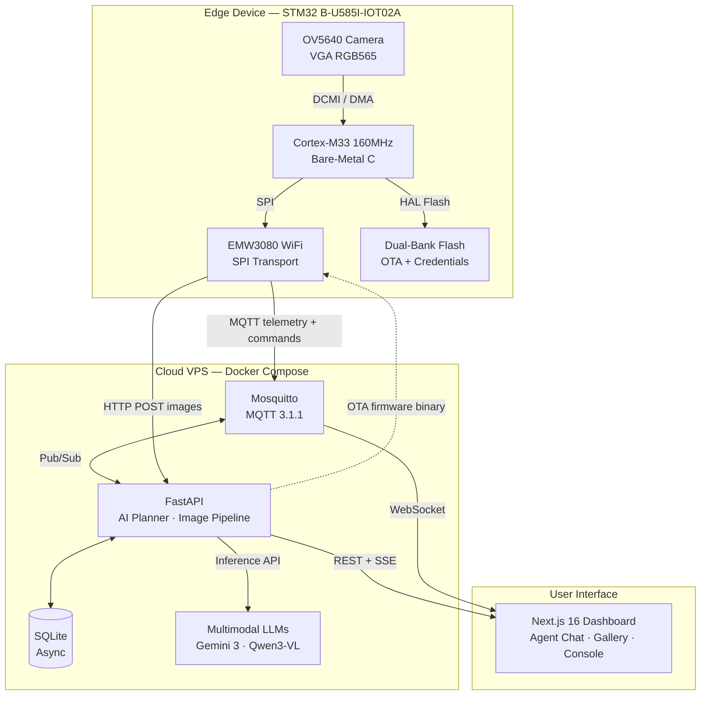

# Autonomous IoT Visual Monitoring System

**Natural language in, autonomous visual intelligence out.**

A complete edge-to-cloud system where you tell an AI agent *what to monitor* in plain English, and a physical STM32 camera board autonomously captures, uploads, and analyzes images using multimodal LLMs — no camera feeds, no manual triggers, no human in the loop.

> Bachelor Thesis — Design and Implementation of an Autonomous IoT Visual Monitoring System with Cloud-Based AI Planning and Analysis
>
> Alexandru-Ionut Cioc | Supervisors: Prof. Tang & Prof. Kouzinopoulos | 2026

<p align="center">
  
  
  
  
  
  
</p>

---

## System Overview

The project spans five layers, from register-level hardware drivers to a cloud AI pipeline:

| Layer | Technology | Lines of Code | What It Does |
|-------|-----------|---------------|--------------|
| **Firmware** | Bare-metal C, ARM Cortex-M33 | ~4,000 | OV5640 camera driver with register-level AEC tuning, hand-rolled MQTT 3.1.1 client, dual-bank OTA, DCMI/DMA capture, STOP2 sleep, hardware watchdog |
| **Backend** | FastAPI, SQLAlchemy async, Python | ~3,000 | AI planning engine, multimodal LLM orchestration, MQTT broker bridge, image pipeline (RGB565 to JPEG), SSE streaming |
| **Frontend** | Next.js 16, React 19, TypeScript | ~2,000 | Real-time MQTT WebSocket dashboard, agentic chat interface, live board console, image gallery with AI analysis overlay |
| **Infrastructure** | Docker Compose, GitHub Actions, Nginx | ~500 | Automated CI/CD, cross-compilation, OTA binary delivery, VPS deployment, container orchestration |
| **Hardware** | STM32 B-U585I-IOT02A Discovery Kit | — | 160MHz Cortex-M33, 768KB SRAM, OV5640 5MP camera, EMW3080 WiFi (SPI), dual-bank 2MB flash |

A `git push` compiles ARM firmware, runs 43 backend tests, builds Docker images, deploys to a VPS, and delivers a firmware update over-the-air to the board.

---

## The Agentic Pipeline

A natural language prompt becomes autonomous hardware behavior:

```mermaid
flowchart LR
    subgraph Input
        User["User prompt\n'Monitor the parking lot\nevery 30 min for 2 hours'"]
    end

    subgraph Planning ["Cloud — AI Planning"]
        Planner["Planning Engine\nClaude / Qwen"]
        Schedule["Schedule\n09:00, 09:30, 10:00, 10:30"]
        Planner --> Schedule
    end

    subgraph Edge ["STM32 Board"]
        MQTT_RX["MQTT\nReceive"]
        RTC["RTC Alarm\nWake from STOP2"]
        CAM["OV5640\nCapture RGB565"]
        Upload["HTTP POST\n614KB in 16KB chunks"]
        MQTT_RX --> RTC --> CAM --> Upload
    end

    subgraph Analysis ["Cloud — Vision Analysis"]
        Convert["RGB565 → JPEG"]
        LLM["Multimodal LLM\nGemini 3 / Qwen3-VL"]
        Result["Findings +\nRecommendation"]
        Convert --> LLM --> Result
    end

    subgraph Output
        Dashboard["Dashboard\nSSE + MQTT WebSocket"]
    end

    User --> Planner
    Schedule -- "MQTT command" --> MQTT_RX
    Upload --> Convert
    Result --> Dashboard
```



Three LLM backends are compared for thesis evaluation:
- **Qwen3-VL-30B-A3B** via vLLM — open-weight, self-hosted
- **Qwen2.5-VL-3B** via vLLM — lightweight edge candidate
- **Gemini 3 Flash** via API — commercial baseline

---

## Architecture



---

## Technical Details

### Firmware (Bare-Metal, No RTOS)

- **Custom MQTT 3.1.1 client** over the EMW3080's TCP socket API. Connect, subscribe, publish, ping, and auto-reconnect in ~400 lines of C.
- **Adaptive AEC convergence** — polls the OV5640's luminance register at 50ms intervals. In well-lit scenes, captures in ~300ms. In dark scenes, detects AEC saturation (stable readings) and exits early instead of wasting the full timeout. Night mode extends exposure to 4x VTS (~300ms) automatically.
- **Over-the-air updates** — board polls for new firmware, downloads to RAM in 2KB chunks (avoiding SPI/flash contention), CRC32-verifies, erases inactive flash bank, writes, and performs atomic bank swap. Automatic rollback on boot failure.
- **STOP2 sleep between tasks** — board enters 2uA deep sleep between scheduled captures, wakes via RTC alarm.
- **Captive portal WiFi provisioning** — no hardcoded credentials. Board starts a SoftAP with a configuration web page at 192.168.10.1 when no stored network is available.
- **9 MQTT command types**: capture_now, capture_sequence, schedule, delete_schedule, firmware_update, sleep_mode, ping, set_wifi, start_portal.

### Backend (FastAPI + AI)

- **AI planning engine** — translates natural language monitoring requests into executable HH:MM task schedules with objectives. The planner is model-agnostic (Claude, Gemini, Qwen).
- **Agentic chat with 8 tools** — the dashboard chat is backed by Claude with tool_use. The agent can capture images, create schedules, ping the board, enter setup mode, analyze results, and synthesize findings — all through natural language.
- **Full capture pipeline with SSE streaming** — when the agent triggers a capture, the server streams real-time progress events (command sent, image received, analysis complete) back to the dashboard. For sequences, it tracks all N images individually.
- **RGB565 to JPEG conversion** — the OV5640 outputs BGR565 little-endian. The server correctly extracts B[15:11] G[10:5] R[4:0], scales to 8-bit, and saves as JPEG.
- **Auto-deactivation** — when the board reports `cycle_complete`, the server automatically deactivates the active schedule.

### Dashboard (Next.js 16 + React 19)

- **Always-visible console** — board firmware logs stream via MQTT (`device/stm32/logs`) and are parsed with the firmware's `[ms] [LEVEL] [TAG] message` format, color-coded by level.
- **Agent chat with tool streaming** — SSE events render as a step-by-step execution trace (thinking, tool calls, results, reply).
- **Real-time telemetry** — board status, firmware version, uptime, WiFi RSSI, capture count, connection state (online/standby/offline) all update live via MQTT WebSocket.
- **Multi-session chat persistence** — conversations are stored in the database and survive page reloads.

### CI/CD

- **Path-based filtering** — `dorny/paths-filter` detects which components changed. A firmware-only change skips dashboard builds.
- **Full pipeline**: pytest (43 tests) -> Biome lint -> TypeScript check -> Next.js build -> ARM GCC cross-compile -> Docker build -> VPS deploy -> OTA firmware upload.
- **Watchtower auto-update** — production containers poll GHCR every 5 minutes and restart on new images.

---

## Repository Structure

```
thesis-iot-monitoring/
  firmware/               Bare-metal C (ARM GCC, STM32U585AI)
    Core/Src/
      main.c              Event loop, scheduler, command dispatch
      camera.c            OV5640 driver, AEC tuning, DCMI/DMA capture
      mqtt_handler.c      Hand-rolled MQTT 3.1.1 client
      ota_update.c        Dual-bank OTA with CRC32 + rollback
      wifi.c              EMW3080 TCP/HTTP, NTP, socket management
      captive_portal.c    SoftAP WiFi provisioning web server
    Core/Inc/
      firmware_config.h   All tuneable parameters in one file
    Drivers/              ST BSP + OV5640 + EMW3080 drivers

  server/                 FastAPI backend (Python 3.12)
    app/
      api/
        agent_routes.py   Agentic chat (Claude tool_use + SSE streaming)
        routes.py         Image upload, RGB565 conversion, analysis trigger
        scheduler_routes.py  Schedule CRUD + MQTT dispatch
      agent/              Chat session persistence (SQLAlchemy)
      analysis/           Multimodal LLM analysis pipeline
      planning/           NL prompt to schedule generation
      mqtt/               Async MQTT client + auto-deactivation
    tests/                43 pytest tests (async, in-memory SQLite)

  dashboard/              Next.js 16 frontend (TypeScript, React 19)
    app/
      page.tsx            Fleet overview with live MQTT telemetry
      board/[id]/page.tsx Board detail: chat + gallery + console
      components/
        AgentChat.tsx     Multi-session chat with SSE tool streaming
      hooks/
        useMQTT.ts        WebSocket MQTT hook with board tracking

  mosquitto/              MQTT broker configuration
  docker-compose.yml      Development stack
  docker-compose.prod.yml Production (GHCR images + Watchtower)
  .github/workflows/
    ci.yml                Adaptive CI/CD pipeline
```

---

## MQTT Command Reference

All commands are JSON payloads on `device/stm32/commands`:

| Command | Payload | Board Response |
|---------|---------|----------------|
| Single capture | `{"type":"capture_now","task_id":N}` | Capture + HTTP upload + status updates |
| Timed sequence | `{"type":"capture_sequence","task_id":N,"delays_ms":[0,5000,10000]}` | Multiple captures at ms offsets |
| Schedule | `{"type":"schedule","tasks":[{"time":"09:00","action":"CAPTURE_IMAGE","objective":"..."}]}` | Stored in RAM, RTC alarms set |
| Delete schedule | `{"type":"delete_schedule"}` | Clears active schedule |
| OTA update | `{"type":"firmware_update"}` | Polls server, downloads, flashes, reboots |
| Sleep toggle | `{"type":"sleep_mode","enabled":true}` | STOP2 between tasks (2uA) |
| Ping | `{"type":"ping"}` | LED strobe (3x red, 3x green) + MQTT ack |
| WiFi config | `{"type":"set_wifi","ssid":"...","password":"..."}` | Save to flash + reconnect |
| WiFi portal | `{"type":"start_portal"}` | Start SoftAP at 192.168.10.1 |
| Erase WiFi | `{"type":"erase_wifi"}` | Wipe credentials + reboot to portal |

---

## Quick Start

### Cloud (VPS or local)

```bash
git clone https://github.com/whitehatd/thesis-iot-monitoring.git
cd thesis-iot-monitoring
cp server/.env.example server/.env   # Configure API keys
docker compose up -d                 # Mosquitto + FastAPI + Dashboard
```

Dashboard at `http://localhost:3000`, API at `http://localhost:8000/docs`.

### Firmware (first flash only)

```bash
cd firmware
make -j8                                              # Cross-compile
make flash                                            # STLink (one time)
# All subsequent updates deploy via OTA through CI/CD
```

Configure `firmware/Core/Inc/firmware_config.h` for your WiFi SSID and server IP. Or use the captive portal — the board broadcasts a setup network on first boot.

### CI/CD (automatic after setup)

Push to `main` -> GitHub Actions builds everything -> VPS deploys -> board updates OTA.

---

<sub>Bachelor thesis project — Alexandru-Ionut Cioc, 2026</sub>
